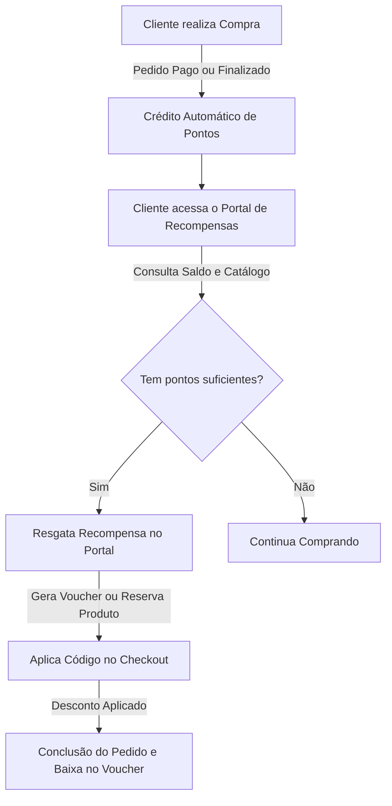
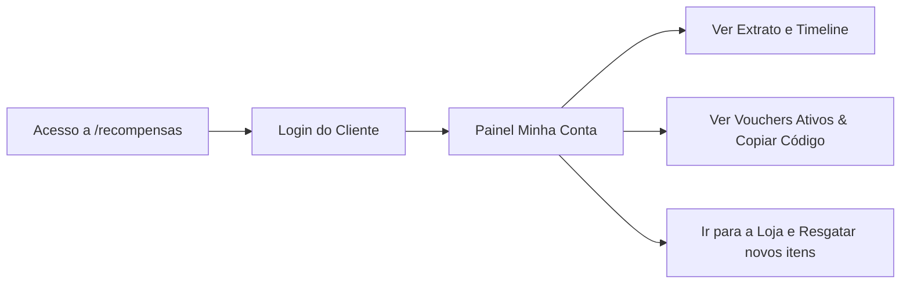

# 🎁 Guia de Funcionamento: Loja de Recompensas & Fidelidade

Bem-vindo à documentação oficial do **Programa de Fidelidade e Loja de Recompensas** da plataforma **Com Amor Vestuário**. Este sistema foi arquitetado para engajar clientes e incentivar compras recorrentes através de um ciclo automático de pontuação, resgate de prêmios e aplicação de descontos.

Abaixo, detalhamos a arquitetura do sistema, o fluxo do cliente, as regras de negócio e as ferramentas administrativas.

---

## 📌 Visão Geral do Fluxo (Life Cycle)

O ciclo de vida do programa de fidelidade segue três etapas principais: **Acumular**, **Resgatar** e **Utilizar**.

---

## 1. 🪙 Como os Pontos são Acumulados (Crédito)

O acúmulo de pontos é **100% automatizado** via banco de dados (`trigger` no PostgreSQL), garantindo segurança e consistência independente do canal de venda.

### Regras de Acúmulo:
* **Gatilho de Pontuação:** Os pontos são calculados e creditados no exato momento em que um pedido muda seu status para **`pago`** ou **`finalizado`**.
* **Fórmula de Conversão:** 
  $$\text{Pontos Ganhos} = \left\lfloor \frac{\text{Valor Total do Pedido}}{\text{Taxa de Conversão}} \right\rfloor$$
  * *Exemplo:* Se a taxa configurada for de **R$ 10,00 = 1 ponto** (parâmetro `points_per_real` nas configurações do site):
    * Um pedido de **R$ 159,90** renderá **15 pontos** (arredondado para baixo).
    * Um pedido de **R$ 299,00** renderá **29 pontos**.
* **Prevenção de Duplicidade:** O banco de dados possui uma restrição única por ID de pedido (`points_ledger_order_unique`). Um pedido **nunca** pontuará duas vezes, mesmo se for reaberto e pago novamente.
* **Transparência:** Cada entrada de pontos cria um registro no extrato do cliente (`points_ledger`) com a razão `'pedido'` e o código do pedido correspondente.

---

## 2. 🛍️ O Catálogo e Tipos de Recompensas

A equipe administrativa pode cadastrar diferentes tipos de benefícios no catálogo. O sistema suporta quatro tipos de recompensas (`reward_kind`):

| Tipo de Recompensa | Funcionamento | Exemplo Prático |
| :--- | :--- | :--- |
| **Produto Físico** (`produto_fisico`) | Troca de pontos por uma peça física real do estoque. Vincula-se a um produto (`product_id`) e variação específica no catálogo. | Troque 150 pontos por um "Cropped Tricot Off-White". |
| **Voucher de Valor Fixo** (`voucher_valor`) | Cupom que concede um abatimento fixo em dinheiro no subtotal da compra. | Troque 50 pontos por um cupom de **R$ 30,00 de desconto**. |
| **Voucher Percentual** (`voucher_percent`) | Cupom que aplica uma porcentagem de desconto sobre o valor dos produtos. | Troque 80 pontos por um cupom de **15% de desconto**. |
| **Voucher de Frete Grátis** (`voucher_frete`) | Cupom que isenta totalmente a taxa de entrega da compra. | Troque 30 pontos por **Frete Grátis**. |

> [!NOTE]
> Todos os vouchers podem ter um **valor mínimo de pedido** (`voucher_min_order`) configurado. Por exemplo, um cupom de R$ 50,00 de desconto pode exigir um carrinho de no mínimo R$ 150,00 para ser validado.

---

## 3. 🔑 Fluxo do Cliente no Portal de Recompensas (`/recompensas`)

O cliente gerencia seu relacionamento com a marca através de uma interface exclusiva, otimizada para dispositivos móveis e com estética *Premium* (Glassmorphism e tons suaves).

### A. Primeiro Acesso e Convite
Como o cliente ganha pontos a partir de sua primeira compra, seus dados já estão cadastrados. 
1. O painel administrativo permite gerar um convite de acesso para o e-mail ou WhatsApp do cliente.
2. É enviada uma **senha temporária** de uso único e o link de acesso.
3. O cliente realiza o login em `/recompensas/login`.

### B. Funcionalidades da Área do Cliente (`/recompensas/minha-conta`)
Dentro de sua conta, o cliente dispõe de 3 abas principais:
1. **Meus Resgates:** Mostra todos os prêmios já resgatados, seus status atuais (Disponível, Utilizado, Expirado ou Cancelado) e os respectivos códigos gerados.
2. **Extrato / Timeline:** Um extrato visual detalhado com entradas (ganho por compras em verde) e saídas (resgate de recompensas em vermelho), informando data, hora e descrição.
3. **Vouchers Ativos:** Uma carteira digital de cupons disponíveis. O cliente vê os cupons ativos, suas datas de validade e possui um botão de **"Copiar código"** com um clique para usar facilmente no checkout.

---

## 4. ⚙️ Regras de Validação e Resgate de Recompensas

Quando o cliente decide resgatar um item na Loja de Recompensas, o sistema executa rigorosas verificações em uma transação segura:

1. **Validação de Saldo:** Verifica se o saldo do cliente (calculado dinamicamente pela soma de créditos e débitos no `points_ledger`) é maior ou igual ao custo em pontos da recompensa (`points_cost`).
2. **Validação de Estoque:** Garante que o item da recompensa ainda possui estoque disponível (`stock > 0`).
3. **Débito de Pontos:** Insere uma linha de débito no `points_ledger` com valor negativo (ex: `-50 pts`) e razão `'resgate'`.
4. **Reserva / Geração de Código:**
   * Se for **Produto Físico**: Decrementa o estoque da recompensa e gera uma solicitação de separação.
   * Se for **Voucher**: Gera um código alfanumérico aleatório de 8 caracteres exclusivos (ex: `A2F866F4`), excluindo caracteres ambíguos (como `0` e `O`, `1` e `I`), e define uma data de validade com base no padrão da marca (geralmente 30 dias).
5. **Atualização do Catálogo:** Deduz 1 unidade do estoque daquela recompensa no banco de dados.

---

## 5. 🛒 Aplicação do Cupom no Checkout

Ao finalizar um pedido na loja virtual da **Com Amor Vestuário**:

1. O cliente insere o código do cupom no campo correspondente.
2. O sistema executa a função `evaluateVoucher(code, customerId, subtotal, shipping)` que realiza as seguintes verificações:
   * **Existência:** O voucher existe no banco de dados?
   * **Propriedade:** O voucher pertence ao cliente logado que está fazendo a compra?
   * **Status:** O voucher está com o status `'resgatado'`? (Não pode ter sido utilizado, expirado ou cancelado).
   * **Validade:** A data atual é anterior à data de expiração (`valid_until`) do cupom?
   * **Valor Mínimo:** O subtotal das peças no carrinho atinge o valor mínimo configurado para aquele cupom?
3. **Cálculo do Desconto:**
   * Se for *Frete Grátis*, zera o valor do frete.
   * Se for *Valor Fixo*, desconta o valor do cupom (limitado ao subtotal).
   * Se for *Percentual*, calcula a porcentagem correspondente sobre o valor das peças.
4. **Finalização:** Assim que o pedido é gerado com sucesso, o cupom é marcado como **`utilizado`**, registrando a data de uso e o ID do pedido gerado, evitando qualquer reuso ilícito.

---

## 6. 🛡️ Painel Administrativo de Recompensas (`/admin/recompensas`)

Os colaboradores e administradores da plataforma possuem uma central de comando completa para gerenciar o programa de fidelidade dividida em três frentes:

### A. Aba "Catálogo"
* **Cadastro de Itens:** Criação de novas recompensas definindo Nome, Descrição, Imagem, Tipo (Produto ou Cupom), Custo em Pontos, Estoque Inicial, Parâmetros do Desconto (R$, % ou Frete), Valor Mínimo do Pedido e Expiração.
* **Controles Rápidos:** Botões para **Editar** dados, **Ativar/Desativar** (oculta temporariamente o item da loja pública de recompensas) ou **Excluir** o registro do banco de dados.

### B. Aba "Resgates"
* **Monitoramento:** Linha do tempo contendo todos os resgates realizados na plataforma, mostrando o código do resgate, data/hora, nome do cliente, recompensa escolhida e o código do cupom gerado.
* **Gestão Manual:** Se necessário (como em casos de devolução física ou suporte ao cliente), o administrador pode alterar o status do resgate de forma manual para: *Resgatado, Utilizado, Expirado ou Cancelado*.

### C. Aba "Pontos e Acessos"
* **Histórico do Livro-Razão:** Auditoria em tempo real de todas as movimentações de pontos de todos os clientes (compras, resgates, ajustes administrativos ou estornos).
* **Gestão de Saldos:** Lista geral de clientes ordenada por quem possui maior pontuação na plataforma.
* **Controle de Acesso ao Portal:**
  * Indica visualmente se o cliente já ativou seu acesso (`✓ acesso ativo`) ou ainda não (`sem acesso`).
  * Botão de **Convidar**: Cria a conta do cliente no Supabase Auth, gera uma senha temporária automática e cria um registro em `portal_invitations` (simulando ou acionando o envio por e-mail/WhatsApp).
  * Botão de **Resetar Senha**: Permite que o administrador resete a senha do cliente instantaneamente em caso de perda ou suporte técnico.

---

> [!TIP]
> **Dica Administrativa:** Recomenda-se criar recompensas de valores variados. Recompensas de frete grátis ou descontos baixos (ex: R$ 10,00 por 25 pontos) mantêm o cliente engajado no curto prazo, enquanto recompensas de produtos físicos exclusivos (ex: 200 pontos) estimulam a fidelidade de longo prazo com maior ticket médio.
