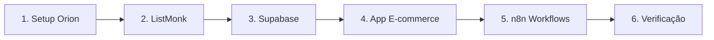

# Manual de Deploy - VPS Contabo

> Guia completo para configurar a infraestrutura de automação de marketing do Com Amor Vestuário.

---

## 📑 Índice

| # | Arquivo | Descrição |
|---|---------|-----------|
| 1 | [01_introducao.md](01_introducao.md) | Visão geral do projeto |
| 2 | [02_setup_orion.md](02_setup_orion.md) | Instalação via Setup Orion |
| 3 | [03_listmonk.md](03_listmonk.md) | Instalação do ListMonk (manual) |
| 4 | [04_supabase_cloud.md](04_supabase_cloud.md) | Supabase Cloud (externo) |
| 5 | [04_supabase_local.md](04_supabase_local.md) | Supabase Local (via Orion) |
| 6 | [05_app_ecommerce.md](05_app_ecommerce.md) | Deploy do app + Bitvise |
| 7 | [06_n8n_workflows.md](06_n8n_workflows.md) | Importar e configurar workflows |
| 8 | [07_verificacao.md](07_verificacao.md) | Testes e troubleshooting |
| 9 | [08_comandos.md](08_comandos.md) | Referência rápida |

---

## 🔄 Fluxo de Instalação



---

## 📋 Pré-requisitos

- ✅ VPS Contabo (Ubuntu 20.04+)
- ✅ Domínio apontando para VPS
- ✅ Acesso SSH ao servidor
- ✅ Projeto clonado: `proj_comamor-vestuario`

---

## 📂 Estrutura de Arquivos

```
proj_comamor-vestuario/
├── docs/manual_deploy_vps/
│   ├── 00_indice.md          ← Você está aqui
│   ├── 01_introducao.md
│   ├── 02_setup_orion.md
│   ├── 03_listmonk.md
│   ├── 04_supabase_cloud.md
│   ├── 04_supabase_local.md
│   ├── 05_app_ecommerce.md
│   ├── 06_n8n_workflows.md
│   ├── 07_verificacao.md
│   └── 08_comandos.md
├── essential/
│   ├── deploy.sh             ← Script de deploy
│   ├── docker-compose.yaml   ← Stack completa
│   ├── .env.example          ← Template de variáveis
│   └── ...
└── n8n/
    └── workflows/            ← 10 workflows prontos
```

---

## ⚡ Quick Start

Se já conhece o processo, siga esta sequência:

```bash
# 1. Setup Orion (escolha as ferramentas)
bash <(curl -sSL setup.oriondesign.art.br)

# 2. ListMonk (manual)
# Ver 03_listmonk.md

# 3. Supabase (uma das opções)
# Ver 04_supabase_cloud.md OU 04_supabase_local.md

# 4. Deploy App
cd essential
cp .env.example .env
./deploy.sh

# 5. n8n
# Ver 06_n8n_workflows.md
```

---

## 📞 Suporte

- **Setup Orion**: [oriondesign.art.br](https://oriondesign.art.br)
- **Projeto**: [GitHub Heverton-web/com-amor-vestuario](https://github.com/Heverton-web/com-amor-vestuario)

---

*Manual criado em: Maio 2026*