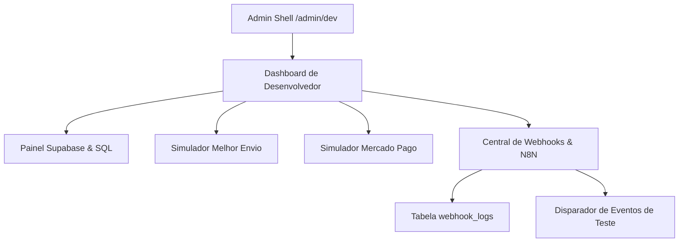

# Plano de Implementação: Ambiente Dev (Developer Console)

Este documento apresenta a proposta arquitetural, melhores práticas e o plano de implementação detalhado para a nova funcionalidade **Ambiente Dev** (Developer Console) na plataforma **Com Amor Vestuário**.

O principal objetivo desta feature é fornecer aos desenvolvedores, QAs e administradores autorizados um painel técnico centralizado de alta fidelidade para monitorar integrações, diagnosticar o estado da base de dados Supabase, simular fluxos críticos (pagamento e frete) e gerenciar/disparar webhooks de eventos da plataforma integrados ao **N8N**.

---

## 🏛️ Proposta Arquitetural (Melhores Práticas)

Para manter a consistência do ecossistema e respeitar a **Arquitetura Baseada em Recursos (Feature-Based Architecture)** do projeto, propomos as seguintes diretrizes:

1. **Isolamento de Domínio (Nova Feature):**
   - Criar um novo módulo em `src/features/desenvolvedor/` utilizando o script padrão: `npm run feature:new desenvolvedor`.
   - Toda a lógica, UI, tipagens e testes dessa central residirão nessa pasta dedicada, evitando poluir o módulo `core` ou `vendas`.

2. **Segurança e Proteção de Dados (Regra de Ouro):**
   - **Controle de Acesso (RBAC):** A rota `/admin/dev` deve ser protegida sob o layout autenticado, restrita estritamente a usuários com perfil de `superadmin` ou `desenvolvedor`.
   - **Mascaramento de Credenciais:** As chaves de API privadas (como segredos do Mercado Pago, tokens de portador do Melhor Envio e chaves `service_role` do Supabase) **nunca** devem ser enviadas na íntegra para o navegador do cliente. O painel front-end exibirá apenas o indicador de status da chave e o final mascarado (ex: `************4b92`).

3. **Arquitetura de Webhooks Assíncrona e Resiliente:**
   - **Fila/Log de Webhooks:** Criar uma tabela física no Supabase para auditar as tentativas de disparos de webhooks (`webhook_logs`). Isso nos dará visibilidade em tempo real sobre falhas (erros 4xx, 5xx ou timeouts do N8N).
   - **Payload Padronizado:** Todos os eventos da plataforma devem usar o mesmo envelope JSON de metadados:
     ```json
     {
       "event": "vendas.pedido_criado",
       "timestamp": "2026-05-18T00:00:00.000Z",
       "environment": "development",
       "data": { ... }
     }
     ```
   - **Orquestração com N8N:** O N8N receberá esses eventos e gerenciará os fluxos de trabalho (integração com ERP, mensagens ao cliente, e-mails).

4. **Simulação Visual Premium (Developer Console Experience):**
   - Estilo visual escuro editorial (Dark Editorial) de alta tecnologia, com componentes de terminal interativo para visualização de payloads JSON, status LEDs de conectividade e alertas micro-animados.

---

## 👥 Revisão de Usuário Requerida

> [!IMPORTANT]
> **1. Estratégia de Configuração das Chaves de API:**
> O ideal para um ambiente de desenvolvimento robusto é permitir que as chaves de API das integrações (Melhor Envio, Mercado Pago, N8N) sejam configuradas dinamicamente via painel administrativo (salvas de forma criptografada no Supabase) ou lidas estaticamente do arquivo `.env` da aplicação. Nossa sugestão é adotar uma **estratégia híbrida**: ler os valores do `.env` por padrão (facilitando o setup local) e permitir a sobrescrita dinâmica opcional no banco para testes rápidos de staging.
>
> **2. Segurança no Disparo de Webhooks para o N8N:**
> Para garantir que o seu servidor N8N processe apenas webhooks legítimos enviados pela plataforma Com Amor, recomendamos implementar **Assinatura HMAC** no cabeçalho das requisições (e.g. `X-Webhook-Signature`). O N8N pode validar essa assinatura usando um nó de criptografia com uma chave secreta compartilhada. Devemos incluir essa segurança na primeira versão?

---

## ❓ Perguntas Abertas

> [!WARNING]
>
> 1. **Melhor Envio:** A API do Melhor Envio utiliza autenticação OAuth2 (com tokens de acesso e refresh). O painel administrativo do "Ambiente Dev" deve incluir um fluxo de autorização visual (botão "Autorizar com Melhor Envio" que redireciona para o login do Melhor Envio e salva o código de autorização)? SIM, DEVE TER UM FLUXO DE AUTORIZAÇÃO VISUAL (botão "Autorizar com Melhor Envio" que redireciona para o login do Melhor Envio e salva o código de autorização)
> 2. **Mocking vs Chamada Real:** Para as simulações de frete (Melhor Envio) e pagamentos (Mercado Pago), você prefere que o painel de dev use o ambiente de **Sandbox** (chamando as APIs de teste reais com tokens de homologação) ou que o painel execute **Mocks Locais** completos (simulação instantânea no front-end sem bater nas APIs externas)?AMBOS

---

## 🛠️ Mudanças Propostas

Separamos a implementação em três camadas principais: Banco de Dados, Backend/API e Frontend/Módulo de UI.



---

### 🗄️ 1. Banco de Dados (Supabase Migrations)

#### [NEW] [20260518000000_ambiente_dev_core.sql](file:///c:/Users/trcnologia/Desktop/proj_comamor-vestuario/supabase/migrations/20260518000000_ambiente_dev_core.sql)

Criação das tabelas administrativas no Supabase para gerenciar as configurações dinâmicas e o log de webhooks.

```sql
-- 1. Tabela de Configurações das Integrações
CREATE TABLE public.integration_settings (
  id UUID PRIMARY KEY DEFAULT gen_random_uuid(),
  provider TEXT NOT NULL UNIQUE, -- 'supabase', 'melhor_envio', 'mercado_pago', 'n8n'
  mode TEXT NOT NULL DEFAULT 'sandbox', -- 'sandbox' ou 'production'
  api_url TEXT,
  public_key TEXT,
  private_key TEXT, -- Chave privada criptografada
  webhook_url TEXT, -- Para o N8N ou integradores
  updated_at TIMESTAMP WITH TIME ZONE DEFAULT timezone('utc'::text, now()) NOT NULL,
  updated_by UUID REFERENCES auth.users(id)
);

-- Habilitar RLS estrito na tabela de credenciais
ALTER TABLE public.integration_settings ENABLE ROW LEVEL SECURITY;

CREATE POLICY "Apenas superadmins podem ler/alterar credenciais"
  ON public.integration_settings
  FOR ALL
  TO authenticated
  USING (
    EXISTS (
      SELECT 1 FROM public.user_roles
      WHERE user_roles.user_id = auth.uid() AND user_roles.role IN ('superadmin', 'desenvolvedor')
    )
  );

-- 2. Tabela de Logs de Webhooks (Auditoria para N8N)
CREATE TABLE public.webhook_logs (
  id UUID PRIMARY KEY DEFAULT gen_random_uuid(),
  event_type TEXT NOT NULL,          -- ex: 'vendas.pedido_criado'
  payload JSONB NOT NULL,            -- Conteúdo enviado
  webhook_url TEXT NOT NULL,         -- URL de destino
  status_code INTEGER,               -- ex: 200, 500
  response_body TEXT,                -- Retorno do N8N
  duration_ms INTEGER,               -- Tempo de resposta
  status TEXT NOT NULL,              -- 'success' ou 'failed'
  created_at TIMESTAMP WITH TIME ZONE DEFAULT timezone('utc'::text, now()) NOT NULL
);

-- RLS para logs de webhooks
ALTER TABLE public.webhook_logs ENABLE ROW LEVEL SECURITY;

CREATE POLICY "Apenas equipe técnica pode ler logs de webhooks"
  ON public.webhook_logs
  FOR SELECT
  TO authenticated
  USING (
    EXISTS (
      SELECT 1 FROM public.user_roles
      WHERE user_roles.user_id = auth.uid() AND user_roles.role IN ('superadmin', 'desenvolvedor')
    )
  );
```

---

### 💻 2. Integração com APIs e Módulo de Serviços

#### [NEW] [webhook-dispatcher.ts](file:///c:/Users/trcnologia/Desktop/proj_comamor-vestuario/src/features/desenvolvedor/services/webhook-dispatcher.ts)

Lógica de backend responsável por disparar os webhooks em tempo real e registrar o histórico no banco de dados.

- Recebe o nome do evento e o payload de qualquer módulo da plataforma (Core, Vendas, Financeiro).
- Obtém a URL do webhook configurada para o N8N.
- Envia a requisição de forma assíncrona.
- Grava um registro na tabela `webhook_logs`.

#### [NEW] [api-diagnostics.ts](file:///c:/Users/trcnologia/Desktop/proj_comamor-vestuario/src/features/desenvolvedor/services/api-diagnostics.ts)

Executa verificações rápidas de integridade ("Pings"):

- **Supabase:** Validação de tempo de query local e status de conexões.
- **Melhor Envio:** Chamada leve de cotação sandbox ou ping de token para verificar expiração.
- **Mercado Pago:** Chamada de validação de credenciais de teste.
- **N8N:** Chamada HEAD na URL configurada para checar conectividade.

---

### 🎨 3. Interface de Usuário (Frontend Módulos)

#### [NEW] [types.ts](file:///c:/Users/trcnologia/Desktop/proj_comamor-vestuario/src/features/desenvolvedor/types.ts)

Definições estritas de tipagens TypeScript para configurações e registros de logs.

#### [NEW] [index.ts](file:///c:/Users/trcnologia/Desktop/proj_comamor-vestuario/src/features/desenvolvedor/index.ts)

Barrel file expondo o componente principal `<DevConsoleDashboard />` de forma limpa.

#### [NEW] [DevConsoleDashboard.tsx](file:///c:/Users/trcnologia/Desktop/proj_comamor-vestuario/src/features/desenvolvedor/components/DevConsoleDashboard.tsx)

Componente unificado do console administrativo com layout modular de abas premium:

1.  **Aba Diagnósticos & Chaves:** Listagem e status visual das APIs e credenciais (Supabase, Melhor Envio, Mercado Pago e N8N).
2.  **Aba Simuladores:**
    - _Simulador Mercado Pago:_ Permite escolher um pedido pendente e liquidá-lo de forma mockada, forçando a alteração de status e disparando o webhook.
    - _Simulador Melhor Envio:_ Campo para testar cotações de CEPs mockados com retorno formatado.
3.  **Aba Console Webhooks (N8N):**
    - Log histórico das últimas 50 requisições enviadas ao N8N com filtros de status (Sucesso/Erro).
    - Visualizador JSON expansível dos payloads.
    - Simulador de Disparador Manual: Escolha o evento (ex: `crm.lead_adicionado`) e clique em "Disparar Webhook de Teste".
4.  **Aba Supabase Admin:**
    - Listagem visual e status das Edge Functions ativas do projeto.
    - Painel indicativo de Migrações aplicadas no banco de dados local.

---

### 🛠️ 4. Ajustes no Núcleo de Rotas e Navegação

#### [MODIFY] [admin-pages.ts](file:///c:/Users/trcnologia/Desktop/proj_comamor-vestuario/src/features/core/utils/admin-pages.ts)

Adicionar a nova categoria "Desenvolvedor" e registrar o atalho para a rota administrativa.

```diff
 export const ADMIN_CATEGORIES: { key: string; label: string }[] = [
   { key: "geral", label: "Geral" },
   { key: "site", label: "Página de vendas" },
   { key: "loja", label: "Loja virtual" },
   { key: "vendas", label: "Vendas" },
   { key: "recompensas", label: "Recompensas" },
   { key: "acompanhamento", label: "Acompanhamento" },
   { key: "analise", label: "Análise" },
+  { key: "desenvolvedor", label: "Desenvolvedor" },
 ];

 export const ADMIN_PAGES: AdminPageDef[] = [
   ...
   { key: "utm", label: "Gerador UTM", path: "/admin/utm", category: "analise" },
+  { key: "dev", label: "Ambiente Dev", path: "/admin/dev", category: "desenvolvedor" },
 ];
```

#### [NEW] [admin.dev.tsx](file:///c:/Users/trcnologia/Desktop/proj_comamor-vestuario/src/routes/_authenticated/admin.dev.tsx)

Arquivo de rota TanStack Router para renderizar o console administrative.

```tsx
import { createFileRoute } from "@tanstack/react-router";
import { DevConsoleDashboard } from "@/features/desenvolvedor";

export const Route = createFileRoute("/_authenticated/admin/dev")({
  component: () => <DevConsoleDashboard />,
});
```

---

## 🧪 Plano de Verificação

### Testes Automatizados (Tipagem e Compilação)

- Executar `npx tsc --noEmit` para validar se todas as novas importações de serviços, hooks e rotas estão tipadas perfeitamente.
- Garantir a integridade das referências às tabelas no Supabase através das definições em `src/features/core/integrations/supabase/types.ts`.

### Verificação Manual (Jornada Técnica)

1.  **Validação de Acesso:** Acessar a rota `/admin/dev` logado como administrador padrão vs administrador superadmin para garantir que a permissão de exibição está agindo corretamente.
2.  **Simulação de Pagamento:** Usar o Simulador do Mercado Pago para pagar um pedido teste e verificar se ele é alterado para "Pago" em tempo real no dashboard e se o webhook correspondente é registrado.
3.  **Monitoramento N8N:** Disparar um evento de teste manualmente e validar no visualizador de logs do dashboard se o payload JSON foi formatado corretamente e se o status code de retorno foi gravado com sucesso.
