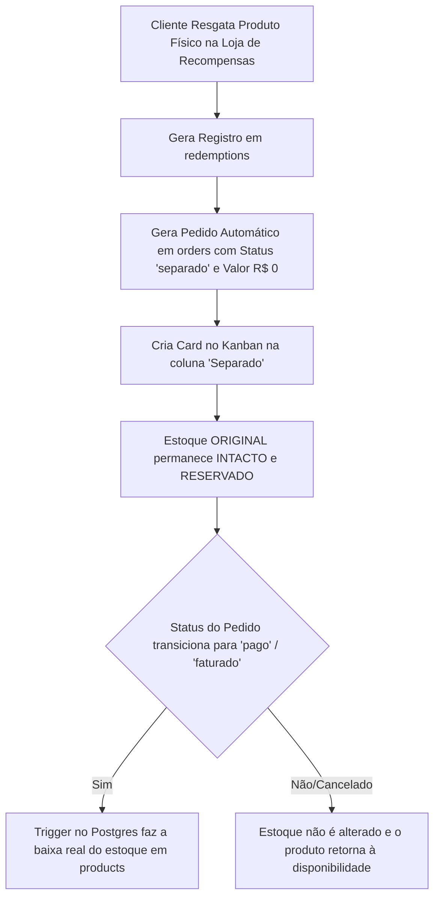

# Análise Técnica e Proposta de Melhoria: Fluxo de Estoque e Resgates

Esta proposta detalha a análise do fluxo atual de gerenciamento de estoque para produtos físicos na Loja de Recompensas da **Com Amor Vestuário**, mapeando vulnerabilidades na lógica atual e apresentando uma solução integrada baseada em integridade relacional e automação via banco de dados (PostgreSQL Triggers).

---

## 🔍 O Cenário Atual (Gaps & Vulnerabilidades)

Analisando a estrutura do banco de dados e as rotas frontend, identificamos os seguintes pontos críticos na lógica atual:

1. **Estoques Duplicados e Desconectados:** 
   Hoje, a tabela `reward_items` gerencia um campo `stock` próprio. Ao criar uma recompensa de `produto_fisico` vinculada a um produto cadastrado na tabela `products`, o administrador precisa digitar manualmente o estoque. Se o estoque real do produto mudar no cadastro principal ou em uma venda, o estoque da recompensa fica desatualizado, gerando divergências e riscos de vender sem estoque real.
   
2. **Resgate sem Pedido de Entrega ("Limbo Operacional"):** 
   Quando o cliente resgata um produto físico, o sistema cria apenas uma linha na tabela `redemptions` e reduz o `stock` isolado da recompensa. **Nenhum pedido convencional (`orders`) é gerado no sistema.** Consequentemente:
   - O time de expedição não visualiza o item a ser enviado no painel de Pedidos ou no Kanban.
   - Não há como embalar, etiquetar ou rastrear essa entrega.
   - Não há controle de "faturamento" ou baixa contábil desse produto.

3. **Baixa Prematura vs Ausência de Baixa:**
   - No checkout público da loja virtual, a baixa do estoque do produto ocorre imediatamente na criação do pedido (status `realizado`), antes mesmo do pagamento.
   - Na criação de pedidos manuais pelo painel administrativo, a baixa de estoque **nunca ocorre** (nem na criação, nem na transição de status).
   - Nos resgates de recompensas físicas, a baixa ocorre apenas no estoque virtual da recompensa, deixando o estoque do produto principal intacto.

---

## 💡 Fluxo de Trabalho Proposto (Melhorias Premium)

Para atender perfeitamente às suas regras de negócio e garantir a integridade dos estoques, propomos um fluxo automatizado e robusto dividido em três pilares:



### 1. Sincronização Inteligente de Estoque na Realocação ("Estoque Único")
- **Regra:** *Quando realocamos um produto físico para a loja de recompensas, a quantidade em estoque deve permanecer a mesma.*
- **Solução:** Em vez de mantermos o estoque na tabela `reward_items`, o catálogo público e o painel administrativo lerão o estoque diretamente da tabela `products` via relacionamento (`product_id`). 
- **Vantagem:** Consistência absoluta de inventário. Qualquer alteração no estoque do produto convencional atualiza instantaneamente a Loja de Recompensas, e vice-versa.

### 2. Automação no Resgate com Status "Separado"
- **Regra:** *Caso o produto seja resgatado, ficará com o status 'separado'.*
- **Solução:** No momento do resgate de um produto físico na Loja de Recompensas, criamos automaticamente um pedido na tabela `public.orders` com o status `'separado'` e valor total igual a `R$ 0,00` (pago com pontos).
- **Ações Automatizadas:**
  1. Insere o registro em `public.redemptions` com status `'resgatado'`.
  2. Insere na tabela `public.orders` um pedido com `status = 'separado'`, `source = 'recompensa'` e `total = 0.00`.
  3. Insere em `public.order_items` o produto físico com `quantity = 1` e `unit_price = 0.00`.
  4. Insere em `public.kanban_cards` o card correspondente no quadro de Pedidos na coluna **Separado**, alertando instantaneamente a expedição.

### 3. Baixa Centralizada no Faturamento
- **Regra:** *Só haverá baixa do estoque quando o pedido for faturado.*
- **Solução:** Remover as baixas de estoque manuais espalhadas pelo frontend (no checkout e nos resgates) e implementar uma **Trigger única e centralizada no banco de dados (PostgreSQL)**.
- **Como funciona:** A trigger monitora a tabela `public.orders`. Sempre que o status de qualquer pedido transicionar para `'pago'` (Faturado/Pago), a trigger faz a baixa das quantidades na tabela `public.products` automaticamente para todos os itens vinculados em `public.order_items`.
- **Vantagem:** Evita erros humanos, falhas de rede do navegador e garante que a baixa ocorra de forma idêntica para vendas da Loja Virtual, pedidos manuais e resgates de recompensas.

---

## 🛠️ Especificação Técnica da Solução (SQL & Código)

### A. Scripts SQL para o Banco de Dados (Supabase Dashboard)

Para implementar essas melhorias, você pode executar o script SQL abaixo diretamente no **SQL Editor** do seu Supabase Dashboard. Ele cria as funções e triggers de controle de estoque e de geração de pedidos de resgate.

```sql
-- 1. Função para sincronizar estoque do produto convencional com o estoque de reward_items
CREATE OR REPLACE FUNCTION public.sync_reward_product_stock()
RETURNS TRIGGER LANGUAGE plpgsql SECURITY DEFINER SET search_path = public AS $$
BEGIN
  -- Se for um produto físico, força o estoque da recompensa a ser igual ao do produto
  IF NEW.kind = 'produto_fisico' AND NEW.product_id IS NOT NULL THEN
    SELECT stock INTO NEW.stock FROM public.products WHERE id = NEW.product_id;
  END IF;
  RETURN NEW;
END;
$$;

-- Criar a trigger para manter estoque de recompensas físicas atualizado na inserção ou edição
CREATE OR REPLACE TRIGGER trg_sync_reward_product_stock
  BEFORE INSERT OR UPDATE ON public.reward_items
  FOR EACH ROW EXECUTE FUNCTION public.sync_reward_product_stock();

-- 2. Trigger para baixar o estoque das peças de um pedido apenas no faturamento (status = 'pago')
CREATE OR REPLACE FUNCTION public.deduct_stock_on_invoice()
RETURNS TRIGGER LANGUAGE plpgsql SECURITY DEFINER SET search_path = public AS $$
DECLARE
  item RECORD;
BEGIN
  -- Só faz a baixa quando o status transiciona para 'pago' (Faturado)
  IF NEW.status = 'pago' AND OLD.status <> 'pago' THEN
    FOR item IN 
      SELECT product_id, quantity 
      FROM public.order_items 
      WHERE order_id = NEW.id AND product_id IS NOT NULL
    LOOP
      UPDATE public.products 
      SET stock = GREATEST(0, stock - item.quantity) 
      WHERE id = item.product_id;
    END LOOP;
  END IF;
  RETURN NEW;
END;
$$;

CREATE OR REPLACE TRIGGER trg_deduct_stock_on_invoice
  AFTER UPDATE ON public.orders
  FOR EACH ROW EXECUTE FUNCTION public.deduct_stock_on_invoice();
```

### B. Adaptação no Frontend (Resgate de Recompensa Física)

No arquivo [recompensas.index.tsx](file:///c:/Users/trcnologia/Desktop/proj_comamor-vestuario/src/routes/recompensas.index.tsx), vamos atualizar a lógica de mutação de resgate para criar o pedido com status `separado` e card de Kanban quando for um produto físico.

#### Código de Mutação Sugerido:
```typescript
  const redeem = useMutation({
    mutationFn: async (reward: RewardItem) => {
      if (!customer) throw new Error("Faça login para resgatar");
      if ((balance ?? 0) < reward.points_cost) throw new Error("Pontos insuficientes");
      
      // Buscar estoque do produto convencional se for físico para validar
      if (reward.kind === "produto_fisico" && reward.product_id) {
        const { data: prod } = await supabase.from("products").select("stock").eq("id", reward.product_id).single();
        if (!prod || prod.stock <= 0) throw new Error("Produto sem estoque físico no momento");
      } else if (reward.stock <= 0) {
        throw new Error("Sem estoque");
      }

      const validUntil = new Date();
      validUntil.setDate(validUntil.getDate() + (branding.redemption_days_default || 30));
      const voucherCode = reward.kind !== "produto_fisico" ? genVoucherCode() : null;

      // 1. Inserir resgate na tabela redemptions
      const { data: red, error } = await supabase
        .from("redemptions" as never)
        .insert({
          customer_id: customer.id,
          reward_item_id: reward.id,
          points_spent: reward.points_cost,
          voucher_code: voucherCode,
          valid_until: validUntil.toISOString().slice(0, 10),
        } as never)
        .select()
        .single();
      if (error) throw error;
      const redemption = red as unknown as { id: string; code: string };

      // 2. Debitar os pontos do ledger do cliente
      await supabase.from("points_ledger" as never).insert({
        customer_id: customer.id,
        delta: -reward.points_cost,
        reason: "resgate",
        redemption_id: redemption.id,
        description: `Resgate: ${reward.name}`,
      } as never);

      // 3. SE for produto físico, gera automaticamente o PEDIDO com status 'separado'
      if (reward.kind === "produto_fisico" && reward.product_id) {
        // Criar o pedido (orders) com total 0.00 e status 'separado'
        const { data: order, error: orderErr } = await supabase
          .from("orders")
          .insert({
            customer_id: customer.id,
            status: "separado", // <-- Regra solicitada: status 'separado'
            source: "recompensa",
            subtotal: 0,
            shipping: 0,
            total: 0,
            notes: `Resgate de Recompensa ${redemption.code}: ${reward.name}`,
          })
          .select()
          .single();

        if (orderErr) throw orderErr;

        // Associar o item físico ao pedido
        await supabase.from("order_items").insert({
          order_id: order.id,
          product_id: reward.product_id,
          product_name: reward.name,
          quantity: 1,
          unit_price: 0,
          total: 0,
          color: reward.product_variant?.color || null,
          size: reward.product_variant?.size || null,
        });

        // Criar o card no Kanban de Pedidos (Estágio 'separado')
        await supabase.from("kanban_cards").insert({
          board: "pedidos",
          stage: "separado",
          title: `Resgate: ${order.code} · ${customer.name}`,
          customer_id: customer.id,
          order_id: order.id,
          amount: 0,
          contact_name: customer.name,
          contact_whatsapp: customer.phone || "",
        });

        // Vincular o ID do pedido gerado de volta no registro de resgate
        await supabase
          .from("redemptions" as never)
          .update({ used_in_order_id: order.id, status: "utilizado", used_at: new Date().toISOString() } as never)
          .eq("id", redemption.id);
      } else {
        // Se for um voucher, decrementa o estoque virtual do próprio item de recompensa
        await supabase.from("reward_items" as never)
          .update({ stock: reward.stock - 1 } as never)
          .eq("id", reward.id);
      }
    },
    onSuccess: () => {
      toast.success("Resgate realizado com sucesso!");
      qc.invalidateQueries({ queryKey: ["rewards-public"] });
      qc.invalidateQueries({ queryKey: ["my-balance"] });
      qc.invalidateQueries({ queryKey: ["my-redemptions"] });
      setConfirming(null);
    },
    onError: (e: Error) => toast.error(e.message),
  });
```

---

## 📈 Benefícios Adicionais das Melhorias Recomendadas

1. **Rastreabilidade Completa:** Todo produto físico resgatado gera um pedido real, integrando-se nativamente com relatórios de vendas, faturamento e expedição da marca.
2. **Segurança de Estoque:** Ao fazer a baixa apenas no status `'pago'` (faturado) por meio de triggers no PostgreSQL, elimina-se o risco de "estouro" ou "reserva permanente" de estoque para pedidos que não foram concretizados (boletos/PIX não pagos).
3. **Redundância Zero no Frontend:** O controle crítico de integridade do estoque fica centralizado no banco de dados, protegendo o sistema contra falhas ou inconsistências caso novas formas de criação de pedidos sejam criadas no futuro (ex: via API ou aplicativo).
