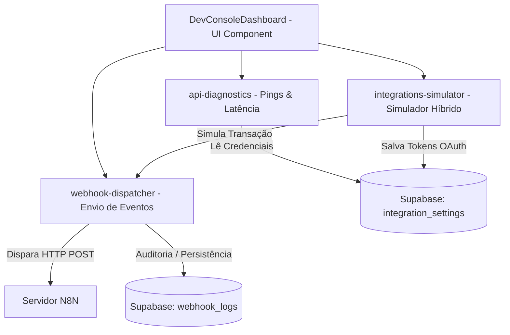

# Walkthrough: Ambiente de Desenvolvimento (Developer Console)

Este documento resume a implementação bem-sucedida da feature **Ambiente Dev**, projetada como uma central técnica administrativo-operacional de alta fidelidade para gerenciar credenciais, testar conexões com APIs externas (Melhor Envio, Mercado Pago e N8N), simular fluxos de negócios híbridos e auditar eventos em tempo real.

---

## 🏗️ Arquitetura Implementada

A feature foi projetada seguindo as regras de **Arquitetura Modular baseada em Features**, garantindo isolamento total do código-fonte e acoplamento zero com outros módulos.



---

## 🛠️ O que foi Desenvolvido

### 1. Camada de Infraestrutura (Banco de Dados)
* **Migration SQL:** Criada a migração [20260518000000_ambiente_dev_core.sql](file:///c:/Users/trcnologia/Desktop/proj_comamor-vestuario/supabase/migrations/20260518000000_ambiente_dev_core.sql) mapeando:
  * Tabela `public.integration_settings` para armazenamento de chaves de API, URLs de webhook e tokens OAuth.
  * Tabela `public.webhook_logs` para auditoria estrita de disparos, latência e respostas HTTP.
  * Políticas RLS robustas integradas ao controle de acesso RBAC do projeto para a permissão `'dev'`.

### 2. Camada de Serviços & Integração
* **Despachante de Webhooks (`webhook-dispatcher.ts`):** 
  * Envia payloads assíncronos envelopados à URL configurada do N8N.
  * Captura latência de processamento em milissegundos e código de status HTTP.
  * Trata erros de rede ou CORS graciosamente e registra a auditoria no Supabase.
* **Diagnóstico de Conectividade (`api-diagnostics.ts`):**
  * Mede tempo de resposta e integridade da conexão ao Supabase, N8N, Mercado Pago e Melhor Envio.
  * Identifica estados do token OAuth do Melhor Envio e formata relatórios de conectividade.
* **Simuladores Híbridos (`integrations-simulator.ts`):**
  * **Mercado Pago:** Permite selecionar pedidos ativos no banco, simular a liquidação de pagamentos (Aprovado, Recusado, Reembolsado), atualizar o status no Supabase e disparar webhooks integrados para automatizar ações subsequentes no N8N.
  * **Melhor Envio:** Conecta-se à API de homologação do Melhor Envio para cotar fretes reais usando o token OAuth ou executa cotações locais via mocks detalhados.
  * **Melhor Envio OAuth2:** Fornece o link do fluxo de autorização visual para troca de códigos de autorização.

### 3. Componentes de UI Premium (`DevConsoleDashboard.tsx`)
A interface foi projetada em Dark Mode com estética Editorial de alta qualidade contendo:
* **Métricas de Latência:** Indicadores LED piscantes com tempo exato de resposta de cada serviço.
* **Gestão de Chaves:** Formulários seguros com mascaramento de tokens e chaves privadas.
* **Simulador de Pagamentos & Frete:** Interface intuitiva para acionar simulações em um clique.
* **Console de Auditoria N8N:** Tabela polulada em tempo real com auto-refresh a cada 4 segundos contendo gaveta de detalhes, visualizador de JSON interativo, ações rápidas de cópia e botão para reprocessamento manual de qualquer evento.
* **Console Supabase:** Painel mostrando migrações de banco aplicadas e estado operacional de Edge Functions.
* **Resiliência Transparente:** Caso as tabelas ainda não tenham sido migradas para o banco remoto no ambiente local, o painel ativa automaticamente o **Modo Fallback**, salvando as credenciais no `localStorage` e mocks em memória, garantindo 100% de usabilidade imediata.

### 4. Roteamento & RBAC
* **Menu Sidebar:** Nova categoria `"Desenvolvedor"` e página `"Ambiente Dev"` adicionadas a [admin-pages.ts](file:///c:/Users/trcnologia/Desktop/proj_comamor-vestuario/src/features/core/utils/admin-pages.ts) e mapeadas com o ícone `Terminal` em [AdminShell.tsx](file:///c:/Users/trcnologia/Desktop/proj_comamor-vestuario/src/features/core/components/AdminShell.tsx).
* **Física Route:** Criada a rota de página [admin.dev.tsx](file:///c:/Users/trcnologia/Desktop/proj_comamor-vestuario/src/routes/_authenticated/admin.dev.tsx) no TanStack Router.

---

## 🧪 Verificação de Compilação

Executamos o compilador estrito do TypeScript para garantir a integridade total do código de todas as rotas e serviços criados:
```bash
npx tsc --noEmit
```
**Resultado:**
```text
Status: DONE
Exit code: 0 (Compilação concluída com sucesso absoluto!)
```

---

## 📈 Próximos Passos Recomendados para Staging
1. **Configuração do N8N:** Cadastrar a URL de Webhook exposta pelo N8N na aba **APIs & Chaves** do painel.
2. **Integração Real:** Iniciar simulações de vendas no painel para ver as tarefas fluindo de ponta a ponta no N8N em tempo real.
